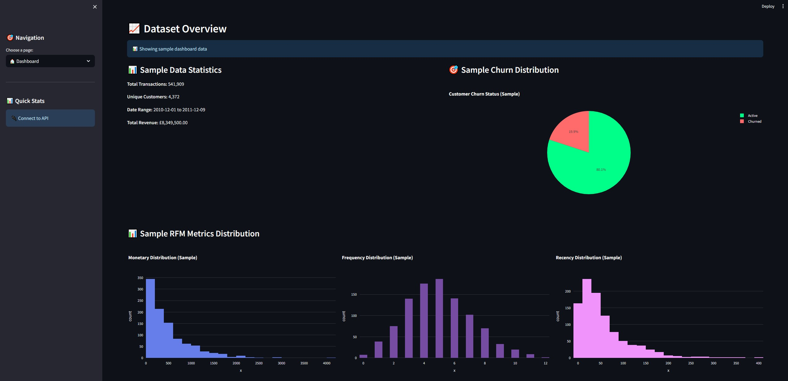
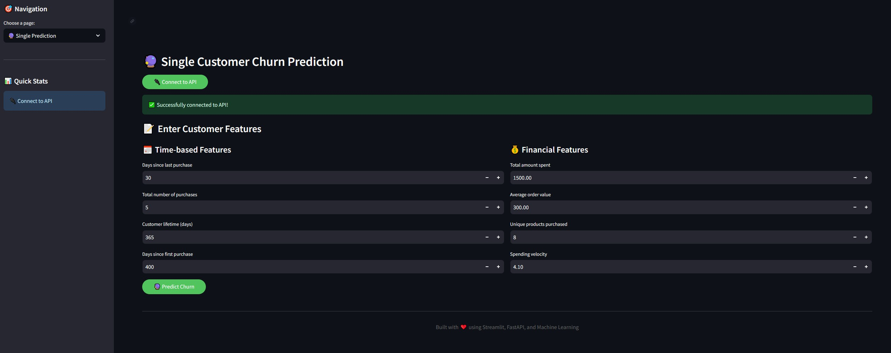
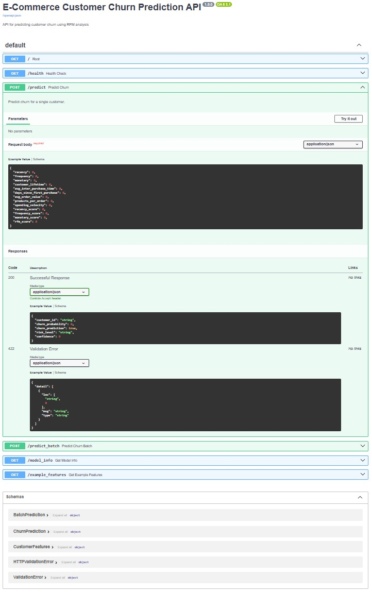

# E-Commerce Customer Churn Prediction

A machine learning project that predicts customer churn using RFM analysis and gradient boosting algorithms. The system uses a modern data stack with **BigQuery** for data warehousing and **dbt** for transformation.

## 🚀 Quick Start

### Prerequisites
- Python 3.9+
- Docker and Docker Compose
- Google Cloud Service Account Key (for BigQuery access)
- Git

### Setup & Installation
1. **Clone the repository**
   ```bash
   git clone <your-repo-url>
   cd E-Commerce-Customer-Churn-Prediction
   ```

2. **Configure Credentials**
   Place your Google Cloud Service Account key in `secrets/google-key.json`.
   ```bash
   mkdir secrets
   # copy your key file here
   ```

3. **Initialize Infrastructure (First Run Only)**
   Creates BigQuery datasets and uploads the initial CSV data.
   ```bash
   pip install google-cloud-bigquery pandas-gbq
   python scripts/setup_bigquery.py
   ```

4. **Install Dependencies**
   ```bash
   pip install -r requirements.txt
   pip install dbt-bigquery
   ```

### 🏃 Running the Pipeline

#### 1. Data Transformation (dbt)
Build the data models (Staging -> Intermediate -> Marts) in BigQuery:
```powershell
.\run_dbt.bat
```

#### 2. Run the Application (Local)
```bash
# Set environment variables for local testing
$env:GCP_PROJECT_ID="airy-web-484800-u5"
$env:GOOGLE_APPLICATION_CREDENTIALS="secrets\google-key.json"

# Run tests/verification
python test_my_functions.py

# Run API
python app/main.py

# Run Streamlit Dashboard
streamlit run app/streamlit_app.py
```

### 🐳 Docker Deployment
Build and run the full stack (API + Dashboard) using Docker Compose. The configuration is already set up to mount your credentials.

```bash
docker-compose up --build
```

## 📸 Application Screenshots

### 🏠 Dashboard


### 🔮 Single Prediction


### 📈 Model Performance


###  API Endpoints


---

## 🏗️ Architecture

### Data Stack
- **Source**: `raw_ecommerce` (BigQuery Dataset)
- **Transformation**: `dbt` (SQL models for cleaning, RFM calculation, and churn labeling)
- **Storage**: `ecommerce_churn` (Final features in BigQuery)

### App Stack
- **FastAPI Backend**: Consumes pre-calculated features from BigQuery.
- **Streamlit Frontend**: Interactive dashboard for churn analysis.
- **Monitoring**: Prometheus + Grafana (optional).

## 📁 Project Structure

```
├── app/                    # Application code
├── dbt/                    # Data transformation models (SQL)
│   ├── models/             
│   │   ├── staging/        # Cleaning logic
│   │   ├── intermediate/   # RFM logic
│   │   └── marts/          # Final features
├── scripts/                # Utility scripts (infra setup)
├── secrets/                # Credentials (not tracked)
├── src/                    # Source modules
│   ├── data/               # DataLoader (BigQuery)
│   └── models/             # ML Model logic
├── Dockerfile             
└── docker-compose.yml      
```

## 📊 API Endpoints

- `GET /` - API information
- `GET /health` - Health check (verifies Model & BQ connection)
- `POST /predict` - Single customer prediction
- `POST /predict_batch` - Batch predictions

## 🚀 CI/CD

GitHub Actions workflow (`deploy.yml`) automatically:
1. **Running dbt tests**: Ensures data quality and schema validation in BigQuery.
2. **Runs App tests**: Verifies Python application logic.
3. **Builds & Deploys**: Docker images (on merge to main).

## 🤝 Contributing

1. Fork the repository
2. Create a feature branch
3. Make your changes
4. Add tests
5. Submit a pull request

## 📄 License

This project is licensed under the MIT License.
