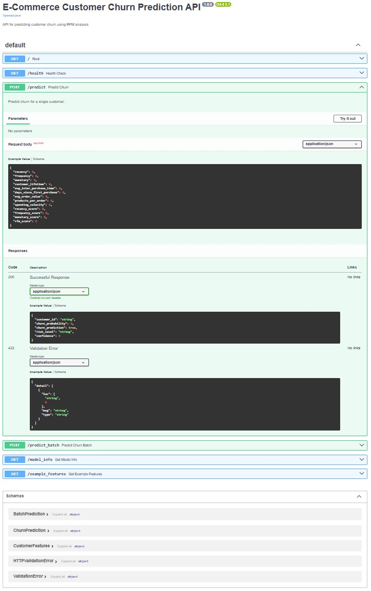

# E-Commerce Customer Churn Prediction

A machine learning project that predicts customer churn using RFM analysis and gradient boosting algorithms.

## 🚀 Quick Start

### Prerequisites
- Python 3.9+
- Docker and Docker Compose
- Git

### Local Development
```bash
# Clone the repository
git clone <your-repo-url>
cd E-Commerce-Customer-Churn-Prediction

# Install dependencies
pip install -r requirements.txt

# Run the API
python app/main.py

# Run Streamlit app
streamlit run app/streamlit_app.py
```

## 📸 Application Screenshots

### 🏠 Dashboard


### 🔮 Single Prediction


### 📈 Model Performance


###  API Endpoints


### Docker Deployment
```bash
# Build and run with Docker Compose
docker-compose up -d

# Rbuild and restart containers
docker-compose down
docker-compose build --no-cache

# Or use the deployment script
./deploy.sh  # Linux/Mac
.\deploy.ps1 # Windows
```

## 🏗️ Infrastructure

### Services
- **FastAPI Backend**: RESTful API for churn predictions
- **Streamlit Frontend**: Interactive web interface
- **Prometheus**: Metrics collection and monitoring
- **Grafana**: Visualization and dashboards
- **AlertManager**: Alerting and notifications

### Ports
- FastAPI: `8000`
- Streamlit: `8501`
- Prometheus: `9090`
- Grafana: `3000`
- AlertManager: `9093`

## 📊 API Endpoints

- `GET /` - API information
- `GET /health` - Health check
- `POST /predict` - Single customer prediction
- `POST /predict_batch` - Batch predictions
- `GET /model_info` - Model information
- `GET /example_features` - Example features for testing

## 🔧 Deployment Options

### 1. Docker Compose (Recommended for Development)
```bash
docker-compose up -d
```

### 2. Kubernetes (Production)
```bash
# Apply all manifests
kubectl apply -k kubernetes/

# Or apply individually
kubectl apply -f kubernetes/namespace.yaml
kubectl apply -f kubernetes/deployment.yaml
kubectl apply -f kubernetes/ingress.yaml
```

### 3. Monitoring Stack
```bash
docker-compose -f monitoring/docker-compose.monitoring.yml up -d
```

## 📈 Monitoring & Observability

### Metrics
- API response times
- Request rates and error rates
- Model prediction latency
- Resource utilization (CPU, memory)

### Alerts
- High error rates
- High response times
- Service downtime
- Resource exhaustion

### Dashboards
- Real-time API performance
- Model prediction analytics
- System resource monitoring

## 🔐 Security

- Non-root Docker containers
- RBAC for Kubernetes
- Environment variable configuration
- Health check endpoints

## 🚀 CI/CD

GitHub Actions workflow automatically:
- Runs tests on pull requests
- Builds Docker images
- Deploys to production (main branch)

## 📁 Project Structure

```
├── app/                    # Application code
│   ├── main.py            # FastAPI application
│   └── streamlit_app.py   # Streamlit interface
├── src/                    # Source modules
├── final_models/          # Trained models
├── kubernetes/            # K8s manifests
├── monitoring/            # Monitoring configs
├── Dockerfile             # Container definition
├── docker-compose.yml     # Local deployment
└── deploy.sh              # Deployment script
```

## 🐛 Troubleshooting

### Common Issues
1. **Model not loaded**: Ensure `final_models/` directory contains trained models
2. **Port conflicts**: Check if ports 8000/8501 are available
3. **Docker issues**: Verify Docker is running and has sufficient resources

### Logs
```bash
# View API logs
docker-compose logs churn-api

# View all logs
docker-compose logs -f

# Kubernetes logs
kubectl logs -f deployment/churn-prediction-api -n churn-prediction
```

## 📚 Documentation

- [API Documentation](http://localhost:8000/docs) (when running)
- [Model Architecture](E-Commerce%20Customer%20Churn%20Prediction.md)
- [Feature Engineering](src/features/rfm_features.py)

## 🤝 Contributing

1. Fork the repository
2. Create a feature branch
3. Make your changes
4. Add tests
5. Submit a pull request

## 📄 License

This project is licensed under the MIT License.
